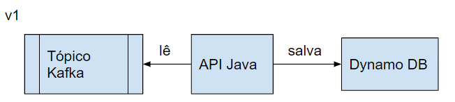
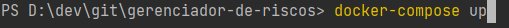

# gerenciador-de-riscos

Esse Microsserviço tem como objetivo ser uma POC (prova de conceito) para elucidar ideias de quais tecnologias e serviços que poderão ser utilizados para gerenciar os riscos como parte dos processos dentro de Oneração.

A ideia principal é construir uma api , que consuma mensagem de um tópico de evento e grave em um banco de dados , considerando ter log de rastreabilidade da aplicação, ter um minimo de teste unitário e tratamento de erro com try catch.

Para o tópico onde será lido as mensagens pensei em utilizar o kafka por ser altamente gerenciável e escalável.

Já para o banco de dados o escolhido foi o DynamoDB uma vez que o volume de dados deve ser muito grande, além de possuir uma flexibilidade com relação aos campos dos objetos que será útil uma vez que as definições das colunas dos riscos podem mudar ao longo do projeto.



## Rodando o localstack

Para simular o DynamoDB e o Kafka rodando na nuvem/AWS iremos utilizar o LocalStack junto ao docker.

Para isso vc deve ter o docker instalado na sua máquina, acessar a pasta raiz do projeto pelo terminal e rodar o comando docker-compose up.


## Criando a tabela localmente

Antes de rodar a aplicação, é necessário que criemos a tabela no LocalStack. Para isso rode o comando abaixo no terminal:

**OBS: caso esteja no windows, recomendo copiar do jeito que está e colar no Git Bash para evitar problemas de copy/paste.

```shell script
aws dynamodb --endpoint-url=http://localhost:4566 create-table \
--table-name riscos-analiticos-interno \
--attribute-definitions \
AttributeName=id,AttributeType=S \
AttributeName=data,AttributeType=S \
--key-schema \
AttributeName=id,KeyType=HASH \
AttributeName=data,KeyType=RANGE \
--provisioned-throughput \
ReadCapacityUnits=10,WriteCapacityUnits=5
```

## Running the application in dev mode

You can run your application in dev mode that enables live coding using:
```shell script
./mvnw compile quarkus:dev
```

> **_NOTE:_**  Quarkus now ships with a Dev UI, which is available in dev mode only at http://localhost:8080/q/dev/.

## Packaging and running the application

The application can be packaged using:
```shell script
./mvnw package
```
It produces the `quarkus-run.jar` file in the `target/quarkus-app/` directory.
Be aware that it’s not an _über-jar_ as the dependencies are copied into the `target/quarkus-app/lib/` directory.

The application is now runnable using `java -jar target/quarkus-app/quarkus-run.jar`.

If you want to build an _über-jar_, execute the following command:
```shell script
./mvnw package -Dquarkus.package.type=uber-jar
```

The application, packaged as an _über-jar_, is now runnable using `java -jar target/*-runner.jar`.

## Creating a native executable

You can create a native executable using: 
```shell script
./mvnw package -Pnative
```

Or, if you don't have GraalVM installed, you can run the native executable build in a container using: 
```shell script
./mvnw package -Pnative -Dquarkus.native.container-build=true
```

You can then execute your native executable with: `./target/gerenciador-de-riscos-1.0.0-SNAPSHOT-runner`

If you want to learn more about building native executables, please consult https://quarkus.io/guides/maven-tooling.

## Related Guides

- SmallRye Reactive Messaging - Kafka Connector ([guide](https://quarkus.io/guides/kafka-reactive-getting-started)): Connect to Kafka with Reactive Messaging
- Amazon DynamoDB ([guide](https://quarkiverse.github.io/quarkiverse-docs/quarkus-amazon-services/dev/amazon-dynamodb.html)): Connect to Amazon DynamoDB datastore
- RESTEasy Classic ([guide](https://quarkus.io/guides/resteasy)): REST endpoint framework implementing JAX-RS and more

## Provided Code

### Reactive Messaging codestart

Use SmallRye Reactive Messaging

[Related Apache Kafka guide section...](https://quarkus.io/guides/kafka-reactive-getting-started)


### RESTEasy JAX-RS

Easily start your RESTful Web Services

[Related guide section...](https://quarkus.io/guides/getting-started#the-jax-rs-resources)
