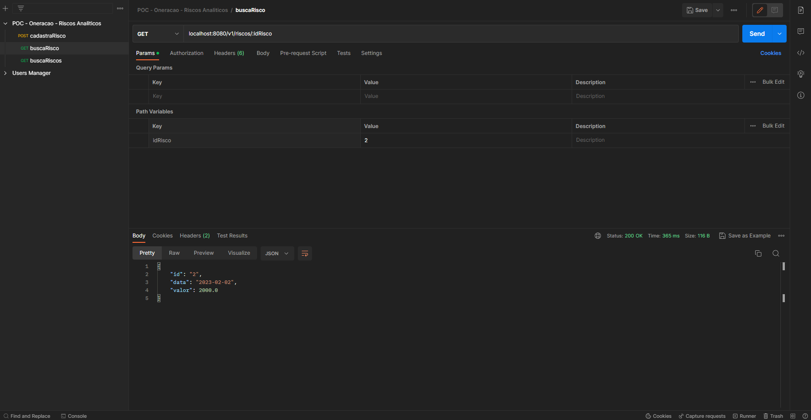

# gerenciador-de-riscos

Esse Microsserviço tem como objetivo ser uma POC (prova de conceito) para elucidar ideias de quais tecnologias e serviços que poderão ser utilizados para gerenciar os riscos como parte dos processos dentro de Oneração.

A ideia principal é construir uma api, que consuma mensagens de um tópico de evento e grave em um banco de dados , considerando ter log de rastreabilidade da aplicação, testes unitários e tratamento de erro.

Para o tópico onde será lido as mensagens pensei em utilizar o kafka por ser altamente gerenciável e escalável.

Já para o banco de dados o escolhido foi o DynamoDB uma vez que o volume de dados deve ser muito grande, além de possuir uma flexibilidade com relação aos campos dos objetos que será útil uma vez que as definições das colunas dos riscos podem mudar ao longo do projeto.


OBS: para a v1, não serão criados os logs de rastreabilidade, teste unitários e tratamento de erros.


## Rodando o DynamoDB e Kafka

Para simular o DynamoDB rodando na nuvem/AWS iremos utilizar o LocalStack junto ao docker, através do arquivo docker-compose.yml  localizado na raiz do projeto.

Além disso, temos no arquivo docker-compose.yml a configuração para rodar o Zookeeper (Componente necessário para rodar o Kafka), Kafka e o Kafdrop (Interface Visual via web que permite visualizar e gerenciar o nosso Kafka).

Para isso vc deve ter o docker instalado na sua máquina, acessar a pasta raiz do projeto pelo terminal e rodar o comando docker-compose up.


Após rodar esse comando ele irá baixar as imagens desses conteiners para sua máquina, caso não tenha feito isso anteriormente, e executar esses serviços localmente.

## Criando a tabela localmente

Após rodar o docker-compose up, antes de rodar a aplicação, é necessário que criemos a tabela no LocalStack. Para isso rode o script init-dynamodb.sh localizado no diretório "scripts" dentro do projeto  no GitBash:


Pronto, a tabela está criada no DynamoDB gerenciado pelo LocalStack!


## Rodando a aplicação!

Antes de tudo, é válido conferirmos se os nossos serviços estão sendo executados corretamente.
Para isso basta rodar o script read-localTable.sh, como mostra a imagem abaixo, abaixo para ler a tabela, que a princípio deve estar vazia:


Se o script retornar as mesmas informações da imagem acima, quer dizer que tudo está certo :)

Para verificar o Kafka, basta acessar no seu navegador a url: http://localhost:19000/ e verificar se abre a página inicial do Kafdrop:


Agora que todas as configurações foram feitas e o DynamoDB e Kafka está rodando corretamente, basta rodarmos o comando abaixo na raiz do projeto para iniciarmos nossa aplicação: 

```shell script
mvn clean compile quarkus:dev
```

Depois de finalizar o startup da aplicação, você irá perceber caso atualize a página do Kafdrop, que o tópico riscos-contratados é criado automaticamente.

Para prova de conceito, criei alguns endpoints para simular o envio de mensagens sinalizando novos riscos contratados. Para conectar esse endpoint e cadastrar 3 riscos novos irei utilizar o Postman e enviar as seguintes requisições:


Podemos ver que os riscos foram criados corretamente na nossa tabela rodando novamente o shell para ler o DynamoDB:


Também foram criados endpoints para lermos a tabela via aplicação:

endpoint para ler a tabela completa:


endpoint para ler registro a partir do id do Risco:



## Logging

Para monitorarmos o que acontece dentro do nosso Microsserviço, é fundamental que seja implementado ferramentas de Logging.

O Logging ajuda a fornecer dados que permitem a identificação de falhas e ajuda até mesmo na hora de obtermos a confirmação de que tudo foi executado conforme o esperado.

A camada de abstração de logging utilizada foi o JBoss Logging. A seguir é possível ver um exemplo de como foi implementado um tratamento de exceção junto ao log:


Através dessa implementação é possível validar de maneira clara se ocorreu um erro ao enviar o risco para o tópico: 


PS: Erro foi gerado propositalmente para fins de simulação!

Ou se o risco foi cadastrado com sucesso.


## Tracing Distribuído

Uma parte fundamental para obtermos a rastreabilidade das chamadas feitas para o nosso sistema é o tracing Distribuído.
Através da implantação dele é possível gerar "rastros" entre os serviços e conectá-los para entender por uma chamada "passou", trazendo assim uma maior observabilidade para o nosso sistema como um todo, independentemente de quantos ou quais serviços ele tenha.  

## Packaging and running the application

> **_NOTE:_**  Quarkus now ships with a Dev UI, which is available in dev mode only at http://localhost:8080/q/dev/.

The application can be packaged using:
```shell script
./mvnw package
```
It produces the `quarkus-run.jar` file in the `target/quarkus-app/` directory.
Be aware that it’s not an _über-jar_ as the dependencies are copied into the `target/quarkus-app/lib/` directory.

The application is now runnable using `java -jar target/quarkus-app/quarkus-run.jar`.

If you want to build an _über-jar_, execute the following command:
```shell script
./mvnw package -Dquarkus.package.type=uber-jar
```

The application, packaged as an _über-jar_, is now runnable using `java -jar target/*-runner.jar`.

## Creating a native executable

You can create a native executable using: 
```shell script
./mvnw package -Pnative
```

Or, if you don't have GraalVM installed, you can run the native executable build in a container using: 
```shell script
./mvnw package -Pnative -Dquarkus.native.container-build=true
```

You can then execute your native executable with: `./target/gerenciador-de-riscos-1.0.0-SNAPSHOT-runner`

If you want to learn more about building native executables, please consult https://quarkus.io/guides/maven-tooling.

## Related Guides

- SmallRye Reactive Messaging - Kafka Connector ([guide](https://quarkus.io/guides/kafka-reactive-getting-started)): Connect to Kafka with Reactive Messaging
- Amazon DynamoDB ([guide](https://quarkiverse.github.io/quarkiverse-docs/quarkus-amazon-services/dev/amazon-dynamodb.html)): Connect to Amazon DynamoDB datastore
- RESTEasy Classic ([guide](https://quarkus.io/guides/resteasy)): REST endpoint framework implementing JAX-RS and more

## Provided Code

### Reactive Messaging codestart

Use SmallRye Reactive Messaging

[Related Apache Kafka guide section...](https://quarkus.io/guides/kafka-reactive-getting-started)


### RESTEasy JAX-RS

Easily start your RESTful Web Services

[Related guide section...](https://quarkus.io/guides/getting-started#the-jax-rs-resources)
